<p align="center">
  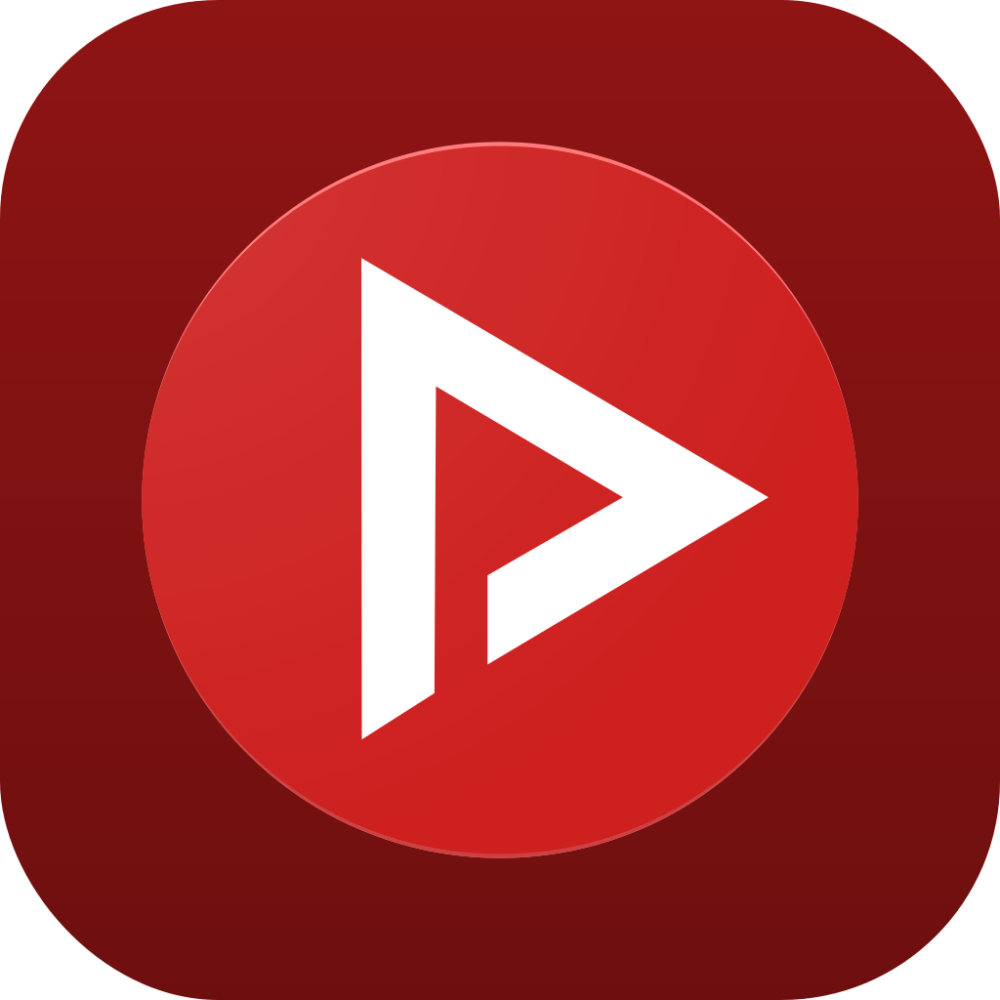
</p>

<h1 align="center">oldpipe</h1>

<p align="center">
  A lightweight, ad-free, account-free YouTube client for <b>iOS 6 through 12</b>.<br>
  Written in Swift, built for hardware Google gave up on more than a decade ago.
</p>

<p align="center">
  
  
  
</p>

---

## Philosophy

oldpipe follows the same principles as [NewPipe](https://newpipe.net) on Android:

- **No ads.** Not blocked, not skipped — never requested in the first place.
- **No account, no sign-in.** You cannot log in, so there is nothing to log in *to*.
- **No tracking.** No analytics SDK, no crash reporter, no telemetry, no phone-home.
- **No Google frameworks.** The app talks to YouTube's own internal `innertube` endpoints
  directly over HTTPS. No YouTube SDK, no Play Services, no API key, no quota.
- **Your data stays on your device.** Subscriptions, playlists, watch history and
  downloads live in `UserDefaults` and the app sandbox. Nothing is ever uploaded.
- **Old hardware deserves good software.** An iPhone 4S is a perfectly capable video
  player. The only thing that stopped working was the software.

> oldpipe is an independent project. It is not affiliated with, endorsed by, or connected
> to YouTube, Google LLC, or the NewPipe project.

---

## Screenshots

### iPhone 4S — iOS 6

| Search | Video | Playing |
|---|---|---|
| 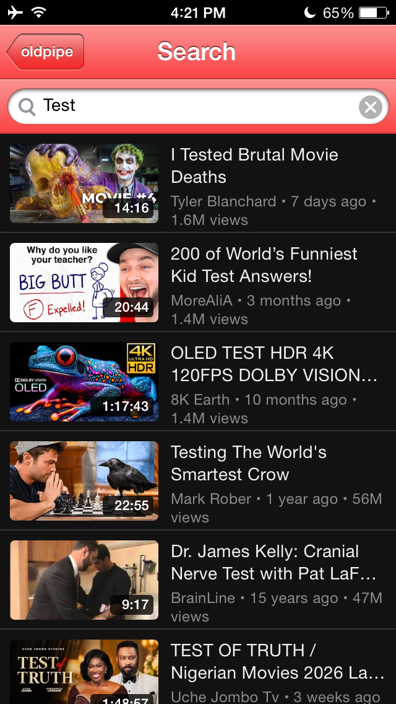 | 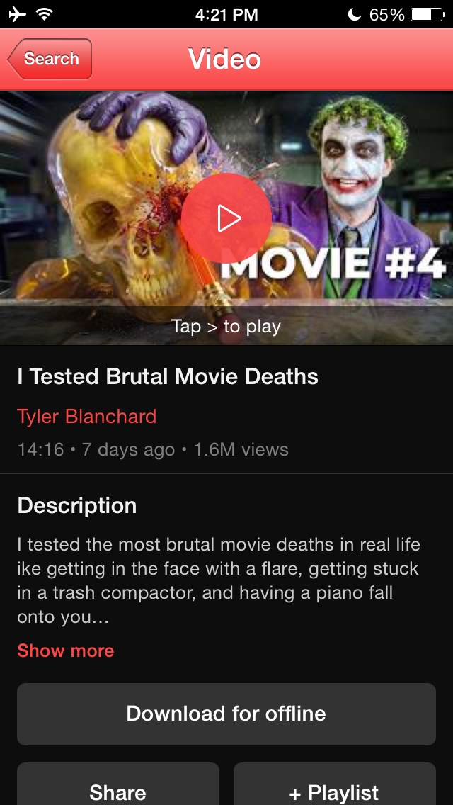 | 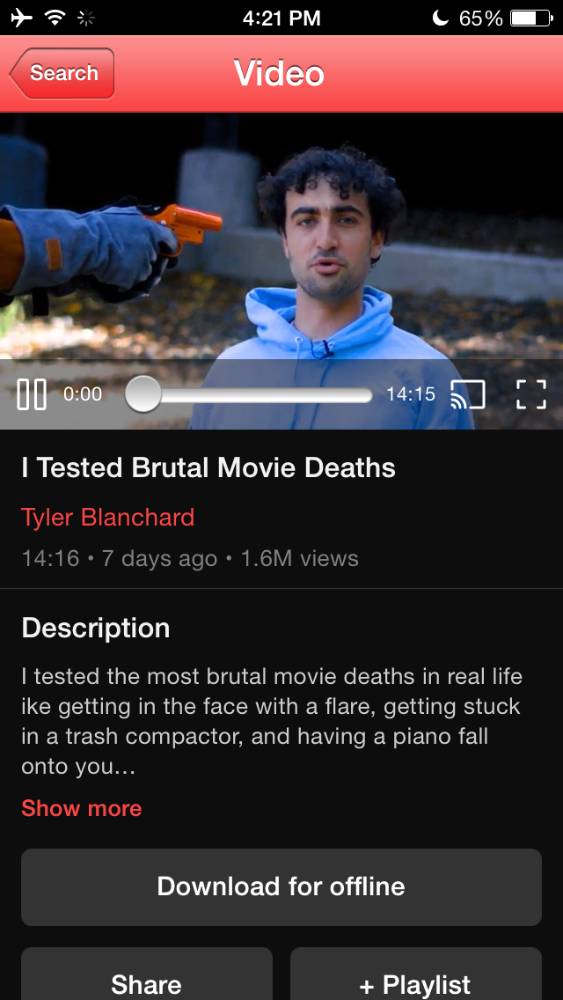 |

| Channel | Menu |
|---|---|
| 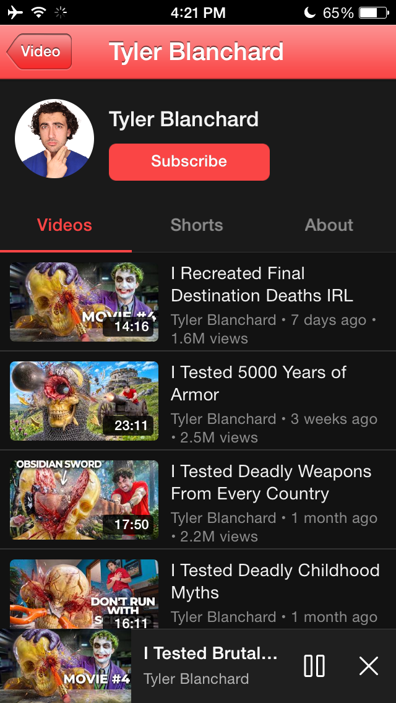 | 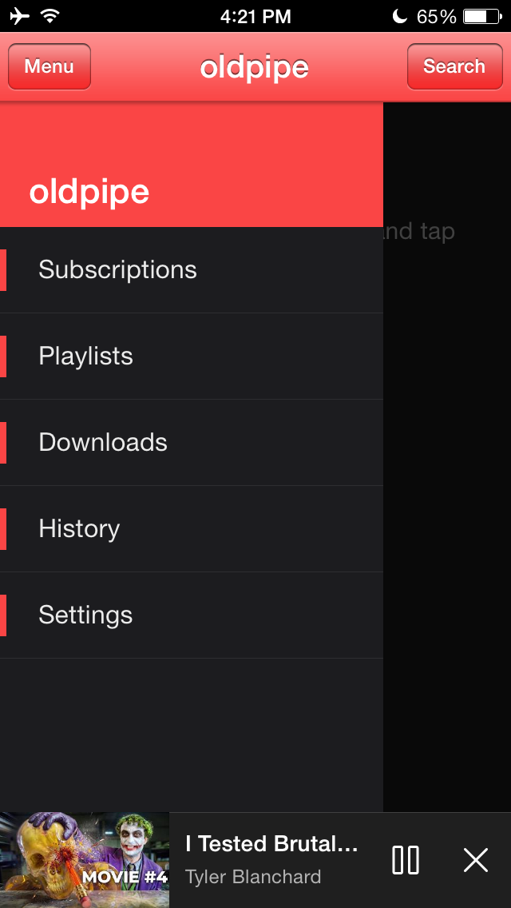 |

### iPhone 5 — iOS 7

| Search | Channel |
|---|---|
| 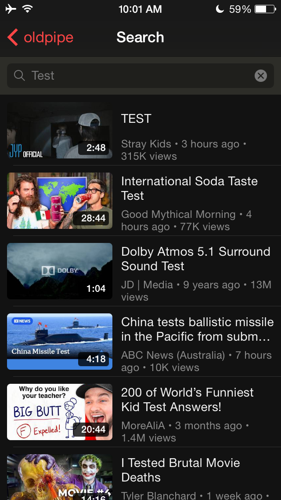 | 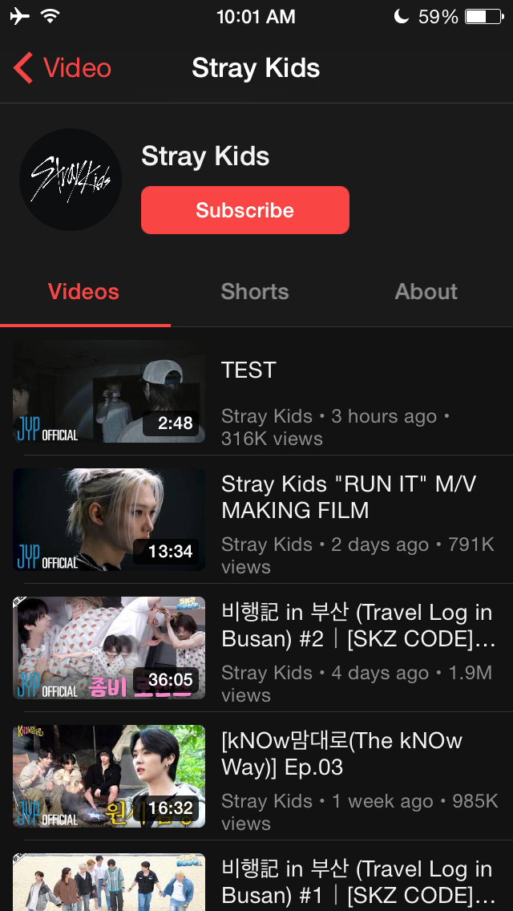 |

### iPad mini — iOS 8 (rotation + reflow)

| Search (landscape) | Video (portrait) | Video (landscape) |
|---|---|---|
| 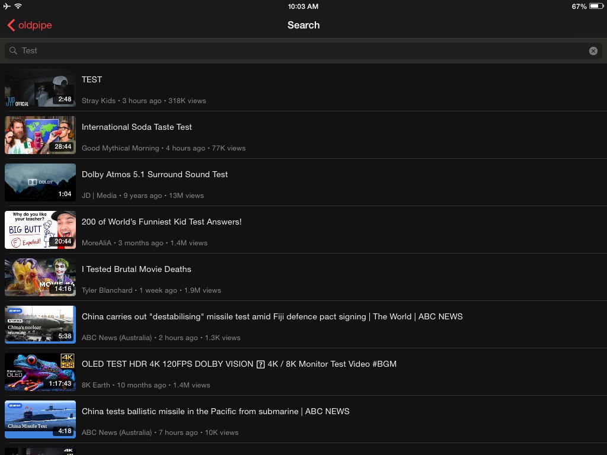 | 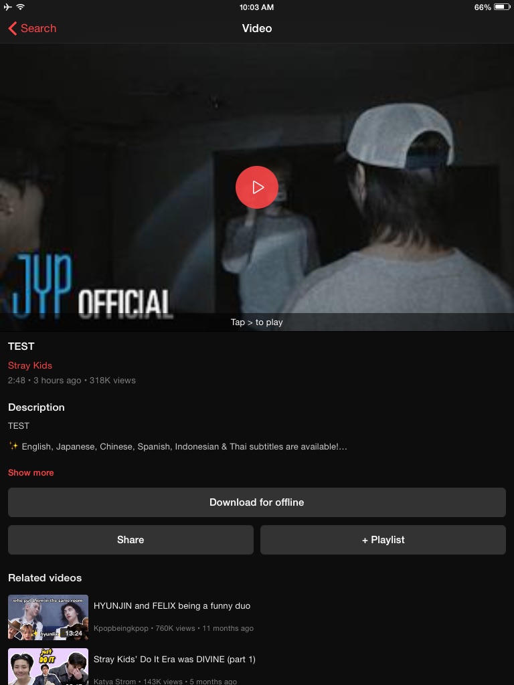 | 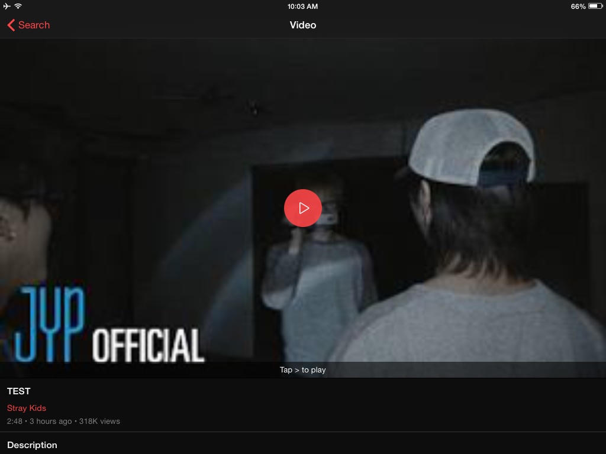 |

---

## Features

**Browsing**
- Search videos and channels
- Trending feed
- Channel pages — Videos / Shorts / About, with subscribe
- Subscriptions feed on the home screen
- Shorts in a TikTok-style vertical pager

**Playback**
- Quality selection up to 1080p, on iOS 6 included
- Captions / subtitles
- Background audio with lock-screen controls and artwork
- Persistent mini player bar that survives navigation
- Double-tap the left/right edge to seek ±15s
- Resume where you left off ("Continue watching")
- Autoplay-next through playlists
- Fullscreen with rotation

**Beyond the app**
- Download videos for offline playback
- Chromecast
- Share links out to any app

**Library (all local)**
- Subscriptions
- Playlists
- Watch history
- Downloads

---

## Install

### Recommended — via the repo (Cydia / Sileo / Zebra)

Add this source:

```
https://cydia.rousseaddict.online
```

The repo page also exposes a direct **OTA install link**, so you can install straight from
Safari on the device without a package manager.

### Manual — sideload the IPA

Prebuilt IPAs live in [`build/`](build/). Pick the one that matches the device:

| File | Target | Notes |
|---|---|---|
| `build/oldpipe_ios6.ipa` | iOS 6 – 7 | Portrait-locked. The baseline build. |
| `build/oldpipe_ios7.ipa` | iOS 7 | Same as above, plus the layout fix for the translucent iOS 7 navigation bar. |
| `build/oldpipe_ios8.ipa` | iOS 8 – 12 | Adds iPad rotation and layout reflow. Tested as far up as iOS 12. |

The IPAs are **ad-hoc signed**, so they install on a jailbroken device
(Filza, `ipainstaller`, AppSync) but not on a stock one. To run on a stock device you must
re-sign the IPA with your own certificate.

---

## Tested on

| Device | OS | Build | Status |
|---|---|---|---|
| iPhone 4S | iOS 6 | `ios6` | Works |
| iPhone 5 | iOS 7 | `ios6` / `ios7` | Works, full 4-inch screen |
| iPad mini (1st gen) | iOS 8 | `ios8` | Works, rotation enabled |
| iPhone 5s | iOS 12 | `ios8` | Works |

---

## Known limitations

These are real, current, and mostly not fixable from inside the app:

- **60 fps videos cap at 480p.** YouTube ships 60 fps uploads as itags 298/299 instead of
  136/137, and the quality ladder does not list them yet. Gaming and sports content is
  affected. Fixing it is on the list.
- **1080p is out of reach for A5 devices.** The iPhone 4S and iPad mini 1 decode roughly
  up to 1080p30 High L4.1. Anything above that will stutter or refuse to play regardless
  of what the quality menu offers.
- **No sign-in.** By design — but it also means no personal recommendations, no
  server-side subscriptions, no liking or commenting. Your subscriptions are local only.
- **No comments section.**
- **Some videos cannot be downloaded or cast.** Downloading and Chromecast both need a
  single self-contained file. When YouTube serves a video only as separate video/audio
  tracks, streaming still works but those two features are unavailable for it.
- **Livestreams are limited.** They play, but seeking within them does not.
- **YouTube can break this at any time.** The app depends on undocumented internal
  endpoints and on client identities that Google periodically invalidates. When playback
  suddenly stops working everywhere, that is usually why — and it usually needs a new
  build to fix.

---

## How it works

Three problems had to be solved to make a modern video service work on a 2012 OS:

1. **TLS.** iOS 6 only negotiates CBC cipher suites. YouTube and its CDN require AES-GCM,
   which arrived in iOS 7. Every HTTP request in the app therefore goes through a
   statically linked **libcurl 8.20 + OpenSSL 3.4**, bypassing the system TLS stack.

2. **AVPlayer.** AVPlayer has its own internal TLS stack and cannot be routed through
   libcurl. oldpipe runs a **loopback HTTP proxy** on the device: AVPlayer connects to
   `127.0.0.1`, the proxy fetches the real bytes over libcurl and relays them, including
   range requests, seeking and mid-stream resume.

3. **Quality above 360p.** Anything above 360p is delivered as separate DASH video and
   audio tracks, which iOS 6 cannot play. oldpipe **transmuxes fragmented MP4 into
   MPEG-TS on the fly** and serves the result to AVPlayer as an HLS stream, entirely on
   the device.

---

## Building

Building requires macOS with **Xcode 13.2.1** and both the **Swift 5.6.3** and
**Swift 5.1.5** toolchains installed side by side.

The three targets come from the same source tree, separated by a compile-time flag:

| Target | Flag | Deployment |
|---|---|---|
| iOS 6/7 | `-D IOS6_TARGET` | 7.0, version-min patched to 6.0 |
| iOS 7 | `-D IOS7_TARGET` | 7.0 |
| iOS 8/9 | `-D IOS8_TARGET` | 8.0 |

The pipeline compiles with **5.6.3** — the 5.1.5 compiler cannot parse modern SDK headers
— then swaps the bundled Swift runtime dylibs for the **5.1.5** ones, which are the newest
that still run on iOS 6. Swift's ABI stability is what makes that combination work. The
`libswiftMetal` dylib is dropped (Metal does not exist before iOS 8, and A5/A6 chips never
supported it), `LC_VERSION_MIN_IPHONEOS` and `MinimumOSVersion` are patched down, and
everything is ad-hoc signed before being zipped into an IPA.

Because the two targets share one DerivedData directory, always run a **clean** build when
switching flags — Swift's incremental compiler will otherwise silently reuse objects built
with the previous flag.

---

## License

oldpipe is free software, licensed under the **GNU General Public License v3.0**.
See [`LICENSE.txt`](LICENSE.txt) for the full text.

```
Copyright (C) 2026 RousseAddict

This program is free software: you can redistribute it and/or modify it under the
terms of the GNU General Public License as published by the Free Software Foundation,
either version 3 of the License, or (at your option) any later version.

This program is distributed in the hope that it will be useful, but WITHOUT ANY
WARRANTY; without even the implied warranty of MERCHANTABILITY or FITNESS FOR A
PARTICULAR PURPOSE. See the GNU General Public License for more details.
```

Bundled third-party components:

| Component | License | GPL-3.0 compatible |
|---|---|---|
| libcurl 8.20.0 | curl (MIT-like) | Yes |
| OpenSSL 3.4.6 | Apache-2.0 | Yes |
